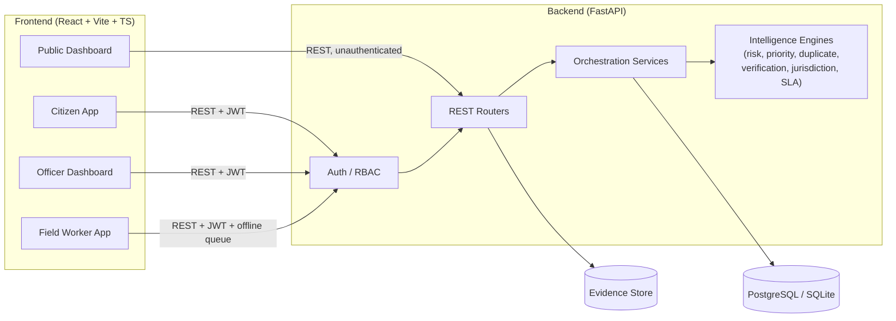
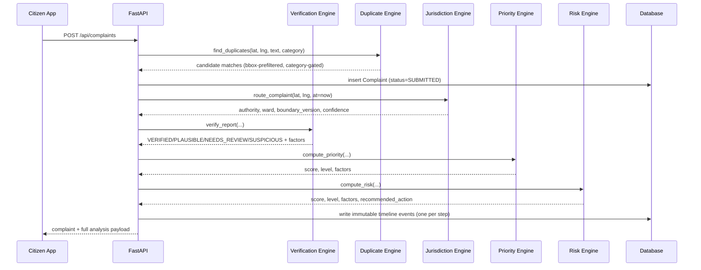
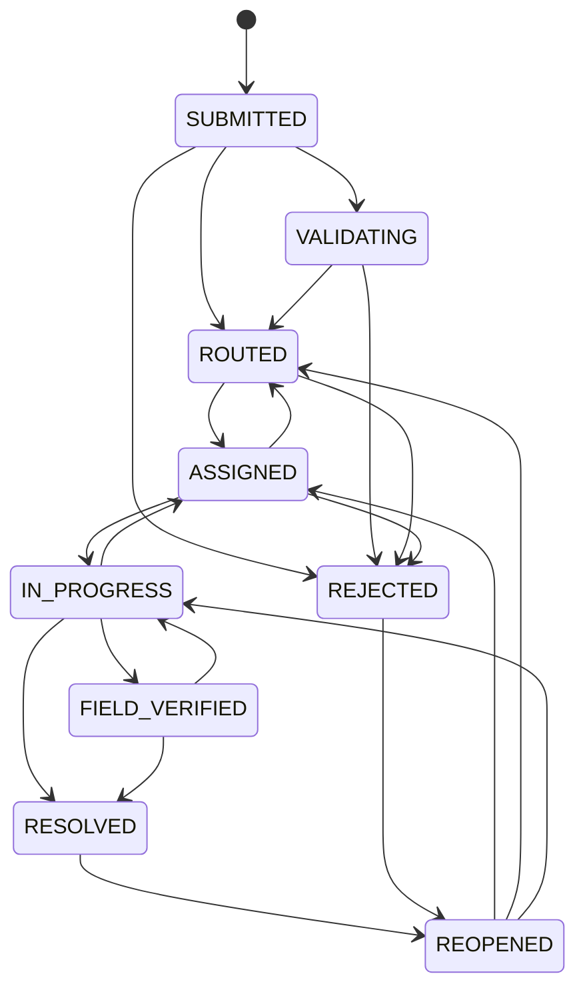
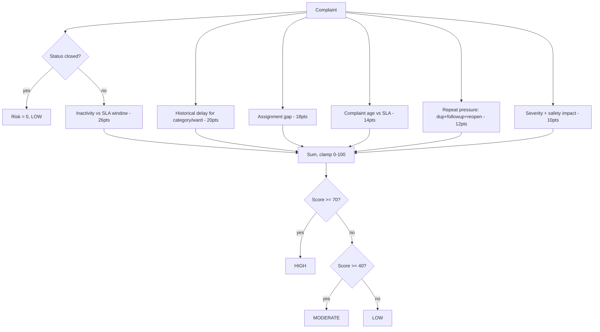
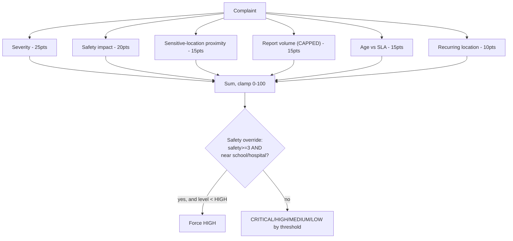
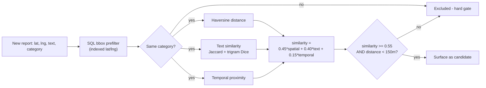
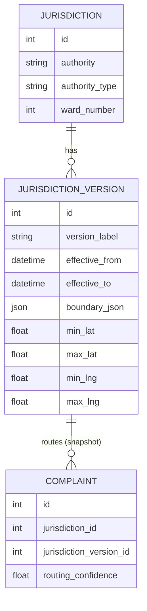
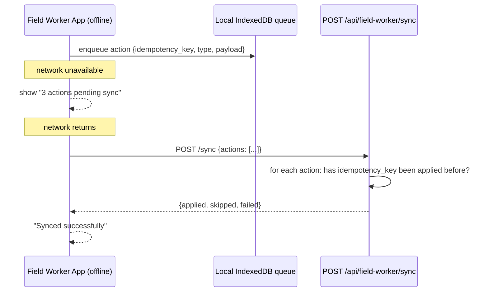

# Architecture

## System overview

## Component responsibilities

| Layer | Location | Responsibility |
|---|---|---|
| Routers | `app/routers/*.py` | HTTP concerns only: parse/validate request, check role, call a service, shape the response. |
| Services | `app/services/*.py` | Orchestration: load rows, call engines, write timeline events, commit. `complaint_service.intake()` is the main pipeline. |
| Engines | `app/engines/*.py` | Pure functions, no DB/IO. Given plain inputs, return a score + explanation. Independently unit-tested. |
| Models | `app/models.py` | SQLAlchemy schema, the state-machine transition table, enums. |
| Security | `app/security.py` | Password hashing, JWT issue/verify, RBAC dependency, jurisdiction-scoped authorisation. |

Keeping engines pure was a deliberate boundary: a router can be wrong about
auth, a service can be wrong about ordering, but a risk score is either
correctly computed from its inputs or it isn't — testing that in isolation,
with no database fixture, is what makes 30+ engine tests fast and reliable.

## Data flow: complaint intake

Every automated decision in this flow writes a `ComplaintStatusHistory` row
with an event type, a human-readable note, and the full factor payload —
this is what the "public transparency" and "explainable AI" requirements
both come from the same table.

## Complaint lifecycle (state machine)

Transitions are enforced server-side by `ALLOWED_TRANSITIONS` in
`app/models.py`; an illegal transition returns `409 Conflict` naming the
allowed set. Field workers can only reach `FIELD_VERIFIED` — closing a
complaint as `RESOLVED` is reserved for officers/admins (separation of
duties).

## Risk engine

## Priority engine

## Duplicate detection

## Jurisdiction routing (versioned)

A complaint stores `jurisdiction_version_id` at the moment it is routed.
Publishing a new `JurisdictionVersion` (with its own `effective_from`) never
touches existing complaint rows — `GET /api/complaints/{id}/jurisdiction`
explicitly returns both "as filed" (historical) and "if filed today"
(current) so the effect of a boundary change is visible, not just asserted.

## Authentication & authorisation

- **JWT** (HS256), issued on login, carrying `sub` (user id), `role`, and
  `jur` (home jurisdiction, if any). 12-hour default expiry.
- **RBAC** via `require_roles(*roles)` dependency — a citizen hitting an
  officer-only route gets `403`, not a filtered response.
- **Object-level authorisation** (IDOR guard): every `GET/PATCH
  /api/complaints/{id}` loads the row first, then checks the *loaded row's*
  citizen/jurisdiction against the caller — never a client-supplied claim.
  Officers are scoped to their home jurisdiction unless it is `null`
  (city-wide officer).
- Passwords are hashed with bcrypt (cost 12), truncated to 72 bytes per
  bcrypt's own limit — done explicitly so a long passphrase degrades
  gracefully instead of 500ing.

## Offline sync

Replaying the same queue twice (a common flaky-connection scenario where the
response is lost but the request landed) applies each action exactly once,
because the server checks `idempotency_key` against `offline_sync_queue`
before doing anything.

## Database schema

All 18+ tables described in the brief are implemented in
`src/backend/app/models.py`: `users`, `jurisdictions`,
`jurisdiction_versions`, `categories`, `sla_rules`, `complaints`,
`complaint_status_history`, `complaint_evidence`, `complaint_followups`,
`assignments`, `duplicate_clusters`, `duplicate_candidates`, `risk_scores`,
`priority_scores`, `audit_logs`, `notifications`, `offline_sync_queue`,
`simulation_runs`.

Key indexes: `complaints(created_at)`, `complaints(status)`,
`complaints(category_id)`, `complaints(jurisdiction_id)`,
`complaints(latitude, longitude)`, plus a composite
`(status, risk_score, priority_score)` index for the officer queue's
default sort and `(jurisdiction_id, status)` for ward-scoped queries.
`jurisdiction_versions` is indexed on its bounding box columns for the SQL
prefilter used by both routing and duplicate detection.

## API architecture

REST, versioned implicitly by path (`/api/...`), JSON in/out. Full route
list and schemas are auto-generated at `/docs` (Swagger UI) from the FastAPI
app. Priority, risk, verification, jurisdiction and status are **always**
server-computed — request schemas (`app/schemas.py`) simply do not include
fields for them, so a client cannot inject a fake score even if it tries
(see `test_server_ignores_client_supplied_scores`).

## Security architecture

- Every input is validated server-side via Pydantic (`app/schemas.py`),
  including a length-and-pattern-bounded email field, control-character
  stripping on free text, and range checks on coordinates.
- File uploads are checked against both declared MIME type and actual magic
  bytes; stored filenames are derived from the content hash, eliminating
  path traversal from user-supplied filenames.
- CORS is restricted to configured origins; security headers
  (`X-Content-Type-Options`, `X-Frame-Options`, `Referrer-Policy`) are set on
  every response.
- Every officer/admin mutation writes an `AuditLog` row with before/after
  state and actor.

## Scaling architecture

See the "Scaling analysis" section of `README.md` for the sizing assumptions
(65 wards, 5,000/day sustained, 50,000/day Dasara peak) and the identified
bottlenecks. For the MVP, the Dasara surge is simulated as an in-process
background task with batched processing and a polled status endpoint,
specifically so the UI never blocks on it — the production path
(queue-based ingestion, worker pool, materialized dashboard aggregates) is
documented as future work in `docs/limitations.md` rather than built, since
a 72-hour hackathon MVP should demonstrate the *pattern*, not stand up a
message broker.
